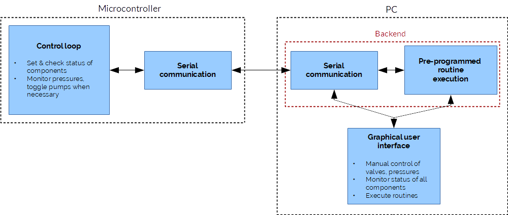

# uFCS-PC

Part of the microfluidics control system. See the [Hackaday.io](https://hackaday.io/project/27511-microfluidics-control-system) page for more details.

## Supported platforms

This application is intended to be cross-platform and compatible with Windows, Linux, macOS, Android and iOS. It makes heavy use of Qt libraries to do so.

Unfortunately, some aspects of Qt are not fully cross-platform. The serial communication libraries, for example, are not compatible with "normal" (un-rooted) versions of Android, and the Bluetooth libraries do not work with Windows.

Therefore, compatibility with all platforms is not guaranteed. 

So far, the application has been used on Windows with the microcontroller connected via USB. Some brief tests have been done on Linux and Android to verify that bluetooth worked there.

## Building

The only prerequisite to build the application should be Qt 5. It has been developed for Qt 5.10 and 5.11, but may also work with previous versions. 

To build the application, simply clone or download this repository and either build it using the Qt Creator IDE, or by running

    qmake ufcs-pc.pro
    make

(replace `make` by `nmake` for Windows)

## Project organisation

First, consider the overall structure of the microfluidics control system software:

It is divided into two main parts: the microcontroller and the host (PC or other device). The two communicate via a simple serial protocol, transmitted either over USB or Bluetooth.

On the host side, the software can be broken down into three main components: the serial communication module; the routine module, which sends pre-programmed protocols to the microcontroller; and the graphical user interface, which lets the user access both manual control and routine running.

The graphical user interface is based on Qt Quick, which uses the QML markup language. The rest of the code is C++. As much of the functionality as possible was written in C++, so that the QML parts would focus almost entirely on the UI design. 

Overall, the code follows an object-oriented approach where each functional unit is represented as a class. For example, the `SerialCommunicator` class handles all serial communication, and offers high-level functions to update the state of valves, pumps etc. that are used both by the `RoutineController` and `ApplicationController` classes. The former of these handles routines, while the latter handles most of the application and communicates with the UI elements.

This approach intends to make it easy to understand how different parts of the application fit together, and to make it relatively painless to update any one part without having to touch other parts. 

## Deploying

### Android
A .apk package is built by Qt Creator when building a project for Android. Not much else is needed, really.

### Windows
Deployment scripts (to build a release version, and create an installer) are in the `deploy` folder.

On top of the requirements for Qt (to simply build the app), you will need:

 - the [Build Tools for Visual Studio 2017](https://visualstudio.microsoft.com/downloads/#build-tools-for-visual-studio-2017)
 - [Inno Setup 5](http://jrsoftware.org/isdl.php#stable)

Adjust the paths as needed in `deploy_windows.bat` to point towards your Qt, Visual Studio Build Tools and Inno Setup installations, then run it. An installer will be created in `build/installer`.

## Customizing the code to your hardware setup

The PC part of the code has very little knowledge of the actual hardware connected to the microcontroller. It does not concern itself with whether a pressure regulator is analog or digital, where it is connected, or what types of valves are connected to what pins, for example.

The few aspects that you may need to customize are the number of valves and pressure regulators, and the bounds (maximum and minimum pressure) of each pressure regulator.

The valves are defined in `src/qml/ManualControl.qml`. By default, the screen is divided into panes for the "flow layer" and "control layer", since we use two different pressure levels for different layers of our microfluidic chip. So here, each pane has a `PressureController` item and several `ValveSwitch` items.

Both of these are initialized with only a number. By default, the valve numbers correspond to the actual markings on the PCB. Switching Valve number 1 on in the PC software will transmit that same information to the microcontroller, which then relates this to the pin that the valve is connected to.

Valve Switches are buttons that make it possible to turn valves on and off, and display their current state. They are defined like so:

    ValveSwitch { valveNumber: 1 }

(See for example line 66 of `ManualControl.qml`). If you wish to add or remove valves, simply edit these lines. You only need to specify a valve here for it to be available to the rest of the program. 

Next, you may need to edit the bounds of the pressure regulators. These are specified in `src/cpp/constants.h`. Simply edit the values for `PR1_MIN_PRESSURE`, `PR1_MAX_PRESSURE` and so on. These are pressures in PSI that are displayed on the screen. They do not affect the values that are sent to the microcontroller (which are always between 0 and 255).
